### Questions

### Objectives
YWBAT 
- apply time series techniques to find insights on a dataset

### Outline
data found [here](https://data.world/data-society/global-climate-change-data/workspace/file?filename=GlobalLandTemperatures%2FGlobalTemperatures.csv)

- Take Questions
- Load in Data
- (20 min) Students will discuss data, transform it, condition it and find trends
- (25 min) Class will discuss any insights found


```python
import pandas as pd
import numpy as np

import matplotlib.pyplot as plt
```


```python
# Load in dataset 
df = pd.read_csv("./data/GlobalLandTemperatures_GlobalTemperatures.csv")
df.head()
```


<div>
<style scoped>
    .dataframe tbody tr th:only-of-type {
        vertical-align: middle;
    }

    .dataframe tbody tr th {
        vertical-align: top;
    }

    .dataframe thead th {
        text-align: right;
    }
</style>
<table border="1" class="dataframe">
  <thead>
    <tr style="text-align: right;">
      <th></th>
      <th>dt</th>
      <th>LandAverageTemperature</th>
      <th>LandAverageTemperatureUncertainty</th>
      <th>LandMaxTemperature</th>
      <th>LandMaxTemperatureUncertainty</th>
      <th>LandMinTemperature</th>
      <th>LandMinTemperatureUncertainty</th>
      <th>LandAndOceanAverageTemperature</th>
      <th>LandAndOceanAverageTemperatureUncertainty</th>
    </tr>
  </thead>
  <tbody>
    <tr>
      <th>0</th>
      <td>1750-01-01</td>
      <td>3.034</td>
      <td>3.574</td>
      <td>NaN</td>
      <td>NaN</td>
      <td>NaN</td>
      <td>NaN</td>
      <td>NaN</td>
      <td>NaN</td>
    </tr>
    <tr>
      <th>1</th>
      <td>1750-02-01</td>
      <td>3.083</td>
      <td>3.702</td>
      <td>NaN</td>
      <td>NaN</td>
      <td>NaN</td>
      <td>NaN</td>
      <td>NaN</td>
      <td>NaN</td>
    </tr>
    <tr>
      <th>2</th>
      <td>1750-03-01</td>
      <td>5.626</td>
      <td>3.076</td>
      <td>NaN</td>
      <td>NaN</td>
      <td>NaN</td>
      <td>NaN</td>
      <td>NaN</td>
      <td>NaN</td>
    </tr>
    <tr>
      <th>3</th>
      <td>1750-04-01</td>
      <td>8.490</td>
      <td>2.451</td>
      <td>NaN</td>
      <td>NaN</td>
      <td>NaN</td>
      <td>NaN</td>
      <td>NaN</td>
      <td>NaN</td>
    </tr>
    <tr>
      <th>4</th>
      <td>1750-05-01</td>
      <td>11.573</td>
      <td>2.072</td>
      <td>NaN</td>
      <td>NaN</td>
      <td>NaN</td>
      <td>NaN</td>
      <td>NaN</td>
      <td>NaN</td>
    </tr>
  </tbody>
</table>
</div>


```python
df.shape, df.info()
```

    <class 'pandas.core.frame.DataFrame'>
    RangeIndex: 3192 entries, 0 to 3191
    Data columns (total 9 columns):
    dt                                           3192 non-null object
    LandAverageTemperature                       3180 non-null float64
    LandAverageTemperatureUncertainty            3180 non-null float64
    LandMaxTemperature                           1992 non-null float64
    LandMaxTemperatureUncertainty                1992 non-null float64
    LandMinTemperature                           1992 non-null float64
    LandMinTemperatureUncertainty                1992 non-null float64
    LandAndOceanAverageTemperature               1992 non-null float64
    LandAndOceanAverageTemperatureUncertainty    1992 non-null float64
    dtypes: float64(8), object(1)
    memory usage: 224.5+ KB


    ((3192, 9), None)


```python
### Transform data to time series
df["dt"] = pd.to_datetime(df["dt"])
df.info()
```

    <class 'pandas.core.frame.DataFrame'>
    RangeIndex: 3192 entries, 0 to 3191
    Data columns (total 9 columns):
    dt                                           3192 non-null datetime64[ns]
    LandAverageTemperature                       3180 non-null float64
    LandAverageTemperatureUncertainty            3180 non-null float64
    LandMaxTemperature                           1992 non-null float64
    LandMaxTemperatureUncertainty                1992 non-null float64
    LandMinTemperature                           1992 non-null float64
    LandMinTemperatureUncertainty                1992 non-null float64
    LandAndOceanAverageTemperature               1992 non-null float64
    LandAndOceanAverageTemperatureUncertainty    1992 non-null float64
    dtypes: datetime64[ns](1), float64(8)
    memory usage: 224.5 KB


```python
df.set_index(keys=['dt'], inplace=True)
df.head()
```


<div>
<style scoped>
    .dataframe tbody tr th:only-of-type {
        vertical-align: middle;
    }

    .dataframe tbody tr th {
        vertical-align: top;
    }

    .dataframe thead th {
        text-align: right;
    }
</style>
<table border="1" class="dataframe">
  <thead>
    <tr style="text-align: right;">
      <th></th>
      <th>LandAverageTemperature</th>
      <th>LandAverageTemperatureUncertainty</th>
      <th>LandMaxTemperature</th>
      <th>LandMaxTemperatureUncertainty</th>
      <th>LandMinTemperature</th>
      <th>LandMinTemperatureUncertainty</th>
      <th>LandAndOceanAverageTemperature</th>
      <th>LandAndOceanAverageTemperatureUncertainty</th>
    </tr>
    <tr>
      <th>dt</th>
      <th></th>
      <th></th>
      <th></th>
      <th></th>
      <th></th>
      <th></th>
      <th></th>
      <th></th>
    </tr>
  </thead>
  <tbody>
    <tr>
      <th>1750-01-01</th>
      <td>3.034</td>
      <td>3.574</td>
      <td>NaN</td>
      <td>NaN</td>
      <td>NaN</td>
      <td>NaN</td>
      <td>NaN</td>
      <td>NaN</td>
    </tr>
    <tr>
      <th>1750-02-01</th>
      <td>3.083</td>
      <td>3.702</td>
      <td>NaN</td>
      <td>NaN</td>
      <td>NaN</td>
      <td>NaN</td>
      <td>NaN</td>
      <td>NaN</td>
    </tr>
    <tr>
      <th>1750-03-01</th>
      <td>5.626</td>
      <td>3.076</td>
      <td>NaN</td>
      <td>NaN</td>
      <td>NaN</td>
      <td>NaN</td>
      <td>NaN</td>
      <td>NaN</td>
    </tr>
    <tr>
      <th>1750-04-01</th>
      <td>8.490</td>
      <td>2.451</td>
      <td>NaN</td>
      <td>NaN</td>
      <td>NaN</td>
      <td>NaN</td>
      <td>NaN</td>
      <td>NaN</td>
    </tr>
    <tr>
      <th>1750-05-01</th>
      <td>11.573</td>
      <td>2.072</td>
      <td>NaN</td>
      <td>NaN</td>
      <td>NaN</td>
      <td>NaN</td>
      <td>NaN</td>
      <td>NaN</td>
    </tr>
  </tbody>
</table>
</div>


```python
df.info()
```

    <class 'pandas.core.frame.DataFrame'>
    DatetimeIndex: 3192 entries, 1750-01-01 to 2015-12-01
    Data columns (total 8 columns):
    LandAverageTemperature                       3180 non-null float64
    LandAverageTemperatureUncertainty            3180 non-null float64
    LandMaxTemperature                           1992 non-null float64
    LandMaxTemperatureUncertainty                1992 non-null float64
    LandMinTemperature                           1992 non-null float64
    LandMinTemperatureUncertainty                1992 non-null float64
    LandAndOceanAverageTemperature               1992 non-null float64
    LandAndOceanAverageTemperatureUncertainty    1992 non-null float64
    dtypes: float64(8)
    memory usage: 224.4 KB


### Data is converted, let's build a plot
---------------------


```python
### make a basic plot of each column with time
df.plot(subplots=True, figsize=(16, 10))
plt.show()
```


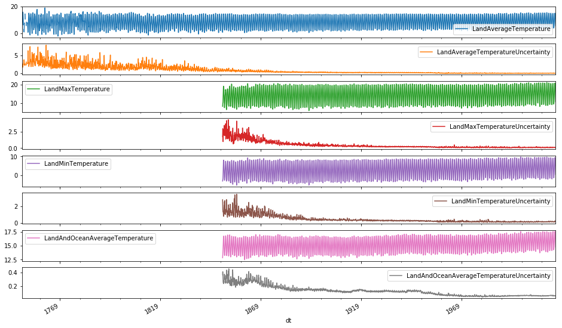


```python
### what insights can you find through time series analysis?
# Let's just investiage the past 50 years
df2 = df[df.index > '1969-12-31']
df2.head()
```


<div>
<style scoped>
    .dataframe tbody tr th:only-of-type {
        vertical-align: middle;
    }

    .dataframe tbody tr th {
        vertical-align: top;
    }

    .dataframe thead th {
        text-align: right;
    }
</style>
<table border="1" class="dataframe">
  <thead>
    <tr style="text-align: right;">
      <th></th>
      <th>LandAverageTemperature</th>
      <th>LandAverageTemperatureUncertainty</th>
      <th>LandMaxTemperature</th>
      <th>LandMaxTemperatureUncertainty</th>
      <th>LandMinTemperature</th>
      <th>LandMinTemperatureUncertainty</th>
      <th>LandAndOceanAverageTemperature</th>
      <th>LandAndOceanAverageTemperatureUncertainty</th>
    </tr>
    <tr>
      <th>dt</th>
      <th></th>
      <th></th>
      <th></th>
      <th></th>
      <th></th>
      <th></th>
      <th></th>
      <th></th>
    </tr>
  </thead>
  <tbody>
    <tr>
      <th>1970-01-01</th>
      <td>2.836</td>
      <td>0.084</td>
      <td>8.288</td>
      <td>0.117</td>
      <td>-2.584</td>
      <td>0.099</td>
      <td>13.711</td>
      <td>0.052</td>
    </tr>
    <tr>
      <th>1970-02-01</th>
      <td>3.735</td>
      <td>0.082</td>
      <td>9.543</td>
      <td>0.108</td>
      <td>-2.020</td>
      <td>0.127</td>
      <td>14.022</td>
      <td>0.053</td>
    </tr>
    <tr>
      <th>1970-03-01</th>
      <td>5.272</td>
      <td>0.114</td>
      <td>11.066</td>
      <td>0.180</td>
      <td>-0.545</td>
      <td>0.211</td>
      <td>14.503</td>
      <td>0.058</td>
    </tr>
    <tr>
      <th>1970-04-01</th>
      <td>8.603</td>
      <td>0.066</td>
      <td>14.383</td>
      <td>0.179</td>
      <td>2.739</td>
      <td>0.113</td>
      <td>15.440</td>
      <td>0.051</td>
    </tr>
    <tr>
      <th>1970-05-01</th>
      <td>11.206</td>
      <td>0.099</td>
      <td>17.165</td>
      <td>0.121</td>
      <td>5.402</td>
      <td>0.107</td>
      <td>16.104</td>
      <td>0.055</td>
    </tr>
  </tbody>
</table>
</div>


```python
### Now let's plot it again
df2.plot(subplots=True, figsize=(16, 10))
plt.show()
```


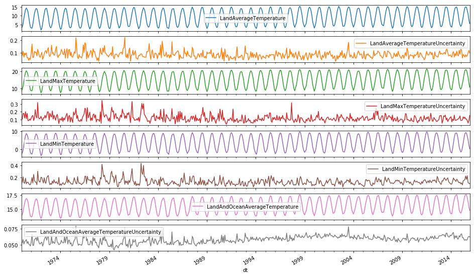


### Okay, let's try and find some kind of correlation here


```python
df2.describe()
```


<div>
<style scoped>
    .dataframe tbody tr th:only-of-type {
        vertical-align: middle;
    }

    .dataframe tbody tr th {
        vertical-align: top;
    }

    .dataframe thead th {
        text-align: right;
    }
</style>
<table border="1" class="dataframe">
  <thead>
    <tr style="text-align: right;">
      <th></th>
      <th>LandAverageTemperature</th>
      <th>LandAverageTemperatureUncertainty</th>
      <th>LandMaxTemperature</th>
      <th>LandMaxTemperatureUncertainty</th>
      <th>LandMinTemperature</th>
      <th>LandMinTemperatureUncertainty</th>
      <th>LandAndOceanAverageTemperature</th>
      <th>LandAndOceanAverageTemperatureUncertainty</th>
    </tr>
  </thead>
  <tbody>
    <tr>
      <th>count</th>
      <td>552.000000</td>
      <td>552.000000</td>
      <td>552.000000</td>
      <td>552.000000</td>
      <td>552.000000</td>
      <td>552.000000</td>
      <td>552.000000</td>
      <td>552.000000</td>
    </tr>
    <tr>
      <th>mean</th>
      <td>9.128788</td>
      <td>0.087043</td>
      <td>14.823933</td>
      <td>0.122397</td>
      <td>3.518391</td>
      <td>0.131946</td>
      <td>15.575864</td>
      <td>0.057906</td>
    </tr>
    <tr>
      <th>std</th>
      <td>4.151471</td>
      <td>0.027095</td>
      <td>4.263117</td>
      <td>0.045466</td>
      <td>4.032501</td>
      <td>0.051693</td>
      <td>1.235743</td>
      <td>0.005561</td>
    </tr>
    <tr>
      <th>min</th>
      <td>1.882000</td>
      <td>0.034000</td>
      <td>7.392000</td>
      <td>0.044000</td>
      <td>-3.549000</td>
      <td>0.045000</td>
      <td>13.298000</td>
      <td>0.042000</td>
    </tr>
    <tr>
      <th>25%</th>
      <td>4.997500</td>
      <td>0.067750</td>
      <td>10.636500</td>
      <td>0.091000</td>
      <td>-0.507500</td>
      <td>0.095000</td>
      <td>14.405000</td>
      <td>0.054000</td>
    </tr>
    <tr>
      <th>50%</th>
      <td>9.347000</td>
      <td>0.084000</td>
      <td>15.127500</td>
      <td>0.113000</td>
      <td>3.678000</td>
      <td>0.125000</td>
      <td>15.590500</td>
      <td>0.058000</td>
    </tr>
    <tr>
      <th>75%</th>
      <td>13.153250</td>
      <td>0.101000</td>
      <td>18.978500</td>
      <td>0.145000</td>
      <td>7.418000</td>
      <td>0.157000</td>
      <td>16.749000</td>
      <td>0.062000</td>
    </tr>
    <tr>
      <th>max</th>
      <td>15.482000</td>
      <td>0.221000</td>
      <td>21.320000</td>
      <td>0.344000</td>
      <td>9.715000</td>
      <td>0.433000</td>
      <td>17.611000</td>
      <td>0.079000</td>
    </tr>
  </tbody>
</table>
</div>


```python
from statsmodels.tsa.seasonal import seasonal_decompose
```


```python
sd = seasonal_decompose(df2)
```


```python
### is there a trend in temperature over time? 
diff_1 = df2.diff(periods=15)
diff_1['LandAverageTemperature'].plot(figsize=(16, 10), subplots=True, style='r.')
plt.show()
```


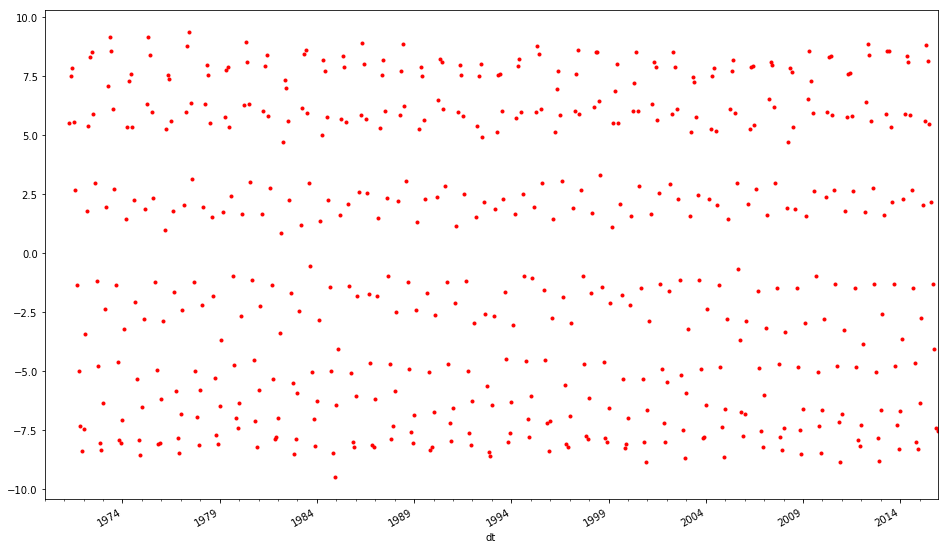


```python
df_annual = df.LandAverageTemperature.resample('A')
```


```python
df_annual_mean = df_annual.mean()
df_annual_mean.head()
```


    dt
    1750-12-31    8.719364
    1751-12-31    7.976143
    1752-12-31    5.779833
    1753-12-31    8.388083
    1754-12-31    8.469333
    Freq: A-DEC, Name: LandAverageTemperature, dtype: float64


```python
df_annual_mean.plot(figsize = (22,8), style = 'b.')
```


    <matplotlib.axes._subplots.AxesSubplot at 0x1c2f7f0e48>


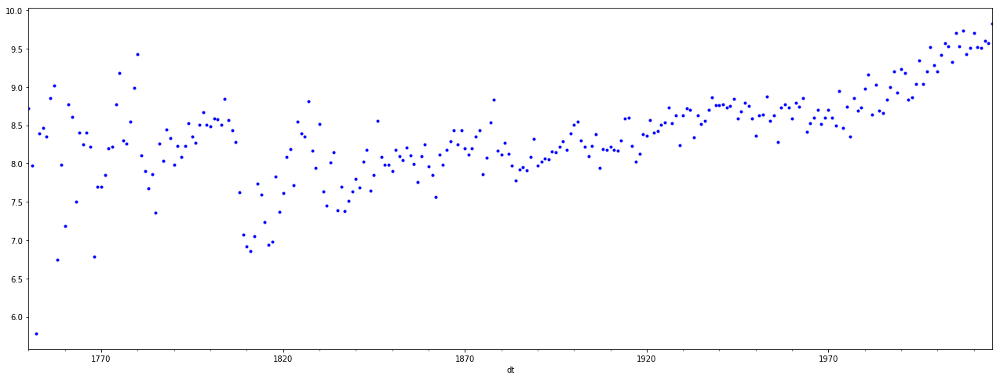


```python
for yr, group in year_temps:
    print(yr)
    print(group)
    break
```

    1970-12-31 00:00:00
                LandAverageTemperature  LandAverageTemperatureUncertainty  \
    dt                                                                      
    1970-01-01                   2.836                              0.084   
    1970-02-01                   3.735                              0.082   
    1970-03-01                   5.272                              0.114   
    1970-04-01                   8.603                              0.066   
    1970-05-01                  11.206                              0.099   
    1970-06-01                  13.513                              0.086   
    1970-07-01                  14.395                              0.100   
    1970-08-01                  13.658                              0.062   
    1970-09-01                  12.277                              0.063   
    1970-10-01                   9.348                              0.042   
    1970-11-01                   6.047                              0.059   
    1970-12-01                   3.521                              0.050   
    
                LandMaxTemperature  LandMaxTemperatureUncertainty  \
    dt                                                              
    1970-01-01               8.288                          0.117   
    1970-02-01               9.543                          0.108   
    1970-03-01              11.066                          0.180   
    1970-04-01              14.383                          0.179   
    1970-05-01              17.165                          0.121   
    1970-06-01              19.368                          0.203   
    1970-07-01              20.254                          0.114   
    1970-08-01              19.430                          0.179   
    1970-09-01              17.879                          0.089   
    1970-10-01              14.960                          0.089   
    1970-11-01              11.562                          0.109   
    1970-12-01               8.941                          0.094   
    
                LandMinTemperature  LandMinTemperatureUncertainty  \
    dt                                                              
    1970-01-01              -2.584                          0.099   
    1970-02-01              -2.020                          0.127   
    1970-03-01              -0.545                          0.211   
    1970-04-01               2.739                          0.113   
    1970-05-01               5.402                          0.107   
    1970-06-01               7.599                          0.189   
    1970-07-01               8.723                          0.099   
    1970-08-01               8.097                          0.122   
    1970-09-01               6.620                          0.124   
    1970-10-01               3.787                          0.103   
    1970-11-01               0.524                          0.082   
    1970-12-01              -1.829                          0.084   
    
                LandAndOceanAverageTemperature  \
    dt                                           
    1970-01-01                          13.711   
    1970-02-01                          14.022   
    1970-03-01                          14.503   
    1970-04-01                          15.440   
    1970-05-01                          16.104   
    1970-06-01                          16.672   
    1970-07-01                          16.912   
    1970-08-01                          16.748   
    1970-09-01                          16.335   
    1970-10-01                          15.420   
    1970-11-01                          14.418   
    1970-12-01                          13.707   
    
                LandAndOceanAverageTemperatureUncertainty  
    dt                                                     
    1970-01-01                                      0.052  
    1970-02-01                                      0.053  
    1970-03-01                                      0.058  
    1970-04-01                                      0.051  
    1970-05-01                                      0.055  
    1970-06-01                                      0.056  
    1970-07-01                                      0.058  
    1970-08-01                                      0.052  
    1970-09-01                                      0.055  
    1970-10-01                                      0.051  
    1970-11-01                                      0.050  
    1970-12-01                                      0.048  


```python
year_matrix.head()
```


<div>
<style scoped>
    .dataframe tbody tr th:only-of-type {
        vertical-align: middle;
    }

    .dataframe tbody tr th {
        vertical-align: top;
    }

    .dataframe thead th {
        text-align: right;
    }
</style>
<table border="1" class="dataframe">
  <thead>
    <tr style="text-align: right;">
      <th></th>
      <th>0</th>
      <th>1</th>
      <th>2</th>
      <th>3</th>
      <th>4</th>
      <th>5</th>
      <th>6</th>
      <th>7</th>
      <th>8</th>
      <th>9</th>
      <th>10</th>
      <th>11</th>
    </tr>
  </thead>
  <tbody>
    <tr>
      <th>1970-12-31</th>
      <td>13.711</td>
      <td>14.022</td>
      <td>14.503</td>
      <td>15.440</td>
      <td>16.104</td>
      <td>16.672</td>
      <td>16.912</td>
      <td>16.748</td>
      <td>16.335</td>
      <td>15.420</td>
      <td>14.418</td>
      <td>13.707</td>
    </tr>
    <tr>
      <th>1971-12-31</th>
      <td>13.615</td>
      <td>13.627</td>
      <td>14.254</td>
      <td>15.227</td>
      <td>15.963</td>
      <td>16.539</td>
      <td>16.846</td>
      <td>16.752</td>
      <td>16.220</td>
      <td>15.298</td>
      <td>14.399</td>
      <td>13.660</td>
    </tr>
    <tr>
      <th>1972-12-31</th>
      <td>13.298</td>
      <td>13.644</td>
      <td>14.446</td>
      <td>15.291</td>
      <td>16.095</td>
      <td>16.729</td>
      <td>16.956</td>
      <td>16.978</td>
      <td>16.270</td>
      <td>15.438</td>
      <td>14.419</td>
      <td>13.951</td>
    </tr>
    <tr>
      <th>1973-12-31</th>
      <td>13.774</td>
      <td>14.140</td>
      <td>14.663</td>
      <td>15.528</td>
      <td>16.288</td>
      <td>16.795</td>
      <td>17.002</td>
      <td>16.889</td>
      <td>16.267</td>
      <td>15.419</td>
      <td>14.381</td>
      <td>13.711</td>
    </tr>
    <tr>
      <th>1974-12-31</th>
      <td>13.300</td>
      <td>13.490</td>
      <td>14.267</td>
      <td>15.182</td>
      <td>15.957</td>
      <td>16.616</td>
      <td>16.846</td>
      <td>16.912</td>
      <td>16.197</td>
      <td>15.274</td>
      <td>14.320</td>
      <td>13.656</td>
    </tr>
  </tbody>
</table>
</div>


```python
def plot_col_heatmap(column):
    year_temps = df[column].groupby(pd.Grouper(freq='A'))
    temp_annual = pd.DataFrame()
    for yr, group in year_temps:
        temp_annual[yr] = group.values.ravel()
    year_matrix = temp_annual.T


    plt.matshow(temp_annual, cmap=plt.cm.Spectral_r, aspect='auto', interpolation=None)
    plt.yticks(ticks=range(len(temp_annual.index)), labels=temp_annual.index)
    plt.xticks(ticks=range(len(temp_annual.columns)), labels=temp_annual.columns, rotation=90)
    plt.show()
```


```python
drop_cols = [col for col in df2.columns if 'Uncertainty' in col]
df2.drop(drop_cols, axis=1, inplace=True)
```

    /anaconda3/lib/python3.7/site-packages/pandas/core/frame.py:3940: SettingWithCopyWarning: 
    A value is trying to be set on a copy of a slice from a DataFrame
    
    See the caveats in the documentation: http://pandas.pydata.org/pandas-docs/stable/indexing.html#indexing-view-versus-copy
      errors=errors)


```python
#What do we notice about the heatmap
# summer is more hot than winter
```


    (12, 46)


```python
for column in df2.columns:
    print(column)
    plot_col_heatmap(column)
    print("\n\n")
```

    LandAverageTemperature


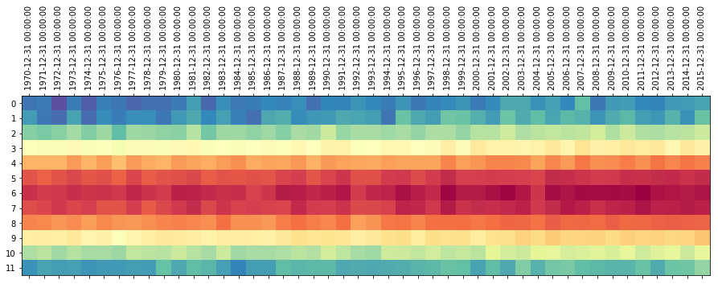


    
    
    
    LandMaxTemperature


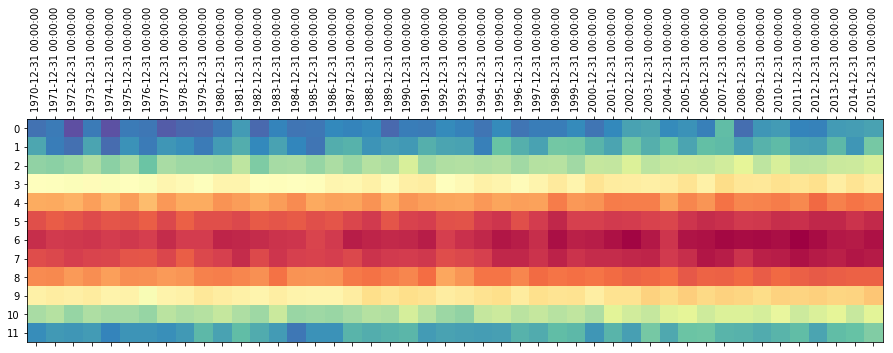


    
    
    
    LandMinTemperature


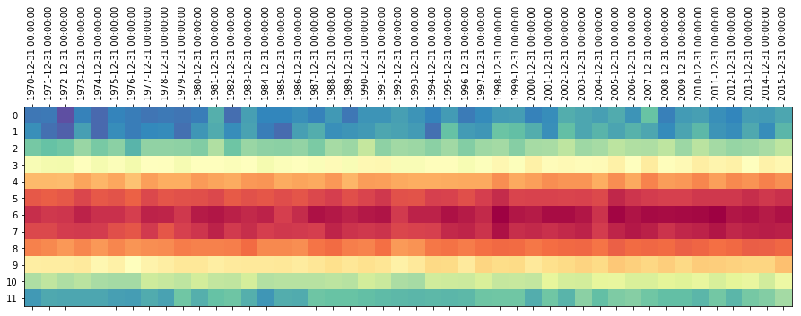


    
    
    
    LandAndOceanAverageTemperature


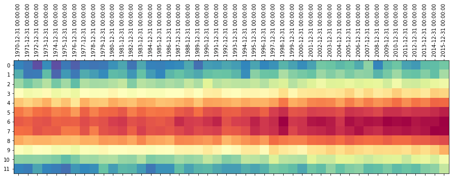


    
    
    


```python
for column in df.drop(drop_cols, axis=1).columns:
    print(column)
    plot_col_heatmap(column)
    print("\n\n")
```

    LandAverageTemperature


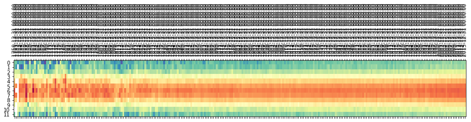


    
    
    
    LandMaxTemperature


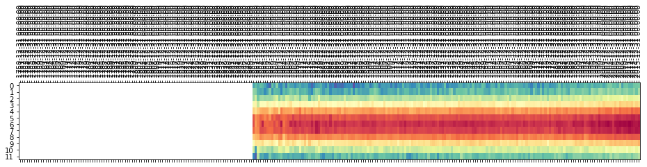


    
    
    
    LandMinTemperature


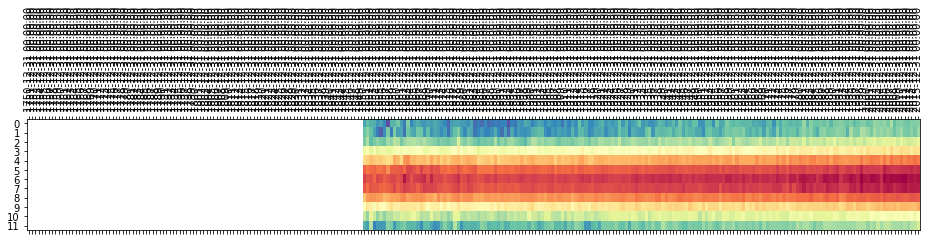


    
    
    
    LandAndOceanAverageTemperature


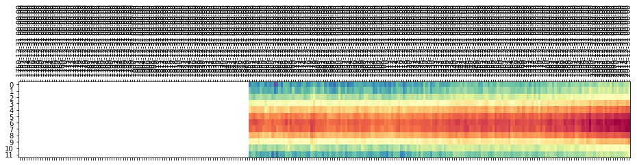


    
    
    


```python

```


```python

```


```python

```


```python

```


```python

```

### Assessment
- Climate change is real
- Learned to utilize the heatmap to spot trends, Spectral_r
- Workflow: putting things together from lessons
