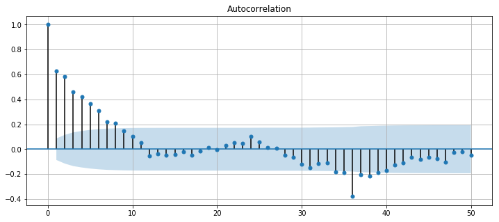
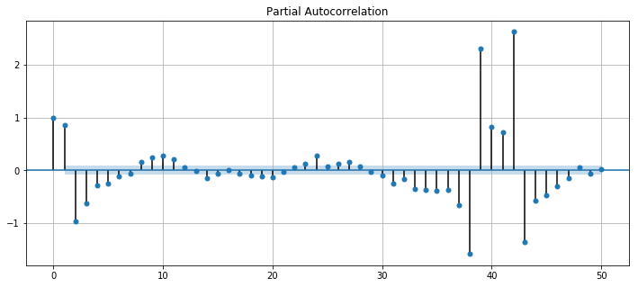
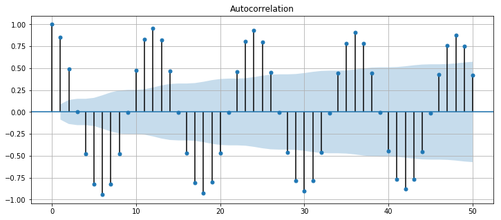
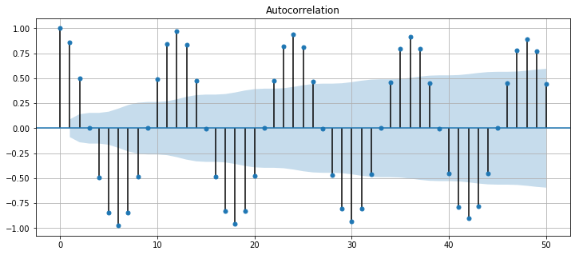
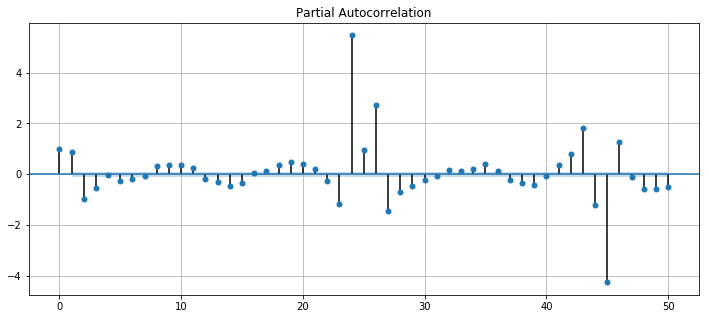
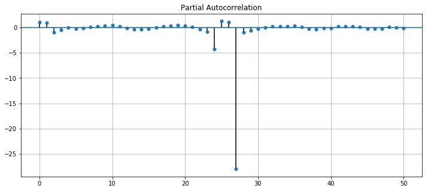
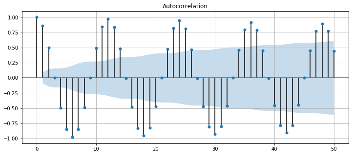
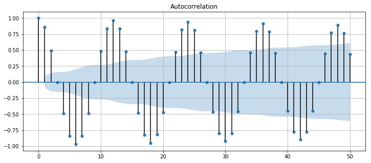
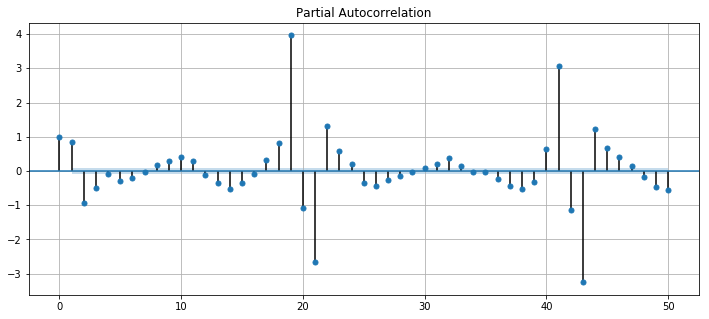

### Questions

### Objectives
YWBAT 
- apply pacf and acf on our data

### Outline
data found [here](https://data.world/data-society/global-climate-change-data/workspace/file?filename=GlobalLandTemperatures%2FGlobalTemperatures.csv)


```python
import pandas as pd
import numpy as np

import matplotlib.pyplot as plt
from pandas.plotting import autocorrelation_plot
from statsmodels.graphics.tsaplots import plot_acf, plot_pacf
```


```python
# Load in dataset 
df = pd.read_csv("./data/GlobalLandTemperatures_GlobalTemperatures.csv")
df.head()
```


<div>
<style scoped>
    .dataframe tbody tr th:only-of-type {
        vertical-align: middle;
    }

    .dataframe tbody tr th {
        vertical-align: top;
    }

    .dataframe thead th {
        text-align: right;
    }
</style>
<table border="1" class="dataframe">
  <thead>
    <tr style="text-align: right;">
      <th></th>
      <th>dt</th>
      <th>LandAverageTemperature</th>
      <th>LandAverageTemperatureUncertainty</th>
      <th>LandMaxTemperature</th>
      <th>LandMaxTemperatureUncertainty</th>
      <th>LandMinTemperature</th>
      <th>LandMinTemperatureUncertainty</th>
      <th>LandAndOceanAverageTemperature</th>
      <th>LandAndOceanAverageTemperatureUncertainty</th>
    </tr>
  </thead>
  <tbody>
    <tr>
      <th>0</th>
      <td>1750-01-01</td>
      <td>3.034</td>
      <td>3.574</td>
      <td>NaN</td>
      <td>NaN</td>
      <td>NaN</td>
      <td>NaN</td>
      <td>NaN</td>
      <td>NaN</td>
    </tr>
    <tr>
      <th>1</th>
      <td>1750-02-01</td>
      <td>3.083</td>
      <td>3.702</td>
      <td>NaN</td>
      <td>NaN</td>
      <td>NaN</td>
      <td>NaN</td>
      <td>NaN</td>
      <td>NaN</td>
    </tr>
    <tr>
      <th>2</th>
      <td>1750-03-01</td>
      <td>5.626</td>
      <td>3.076</td>
      <td>NaN</td>
      <td>NaN</td>
      <td>NaN</td>
      <td>NaN</td>
      <td>NaN</td>
      <td>NaN</td>
    </tr>
    <tr>
      <th>3</th>
      <td>1750-04-01</td>
      <td>8.490</td>
      <td>2.451</td>
      <td>NaN</td>
      <td>NaN</td>
      <td>NaN</td>
      <td>NaN</td>
      <td>NaN</td>
      <td>NaN</td>
    </tr>
    <tr>
      <th>4</th>
      <td>1750-05-01</td>
      <td>11.573</td>
      <td>2.072</td>
      <td>NaN</td>
      <td>NaN</td>
      <td>NaN</td>
      <td>NaN</td>
      <td>NaN</td>
      <td>NaN</td>
    </tr>
  </tbody>
</table>
</div>


```python
df.shape, df.info()
```

    <class 'pandas.core.frame.DataFrame'>
    RangeIndex: 3192 entries, 0 to 3191
    Data columns (total 9 columns):
    dt                                           3192 non-null object
    LandAverageTemperature                       3180 non-null float64
    LandAverageTemperatureUncertainty            3180 non-null float64
    LandMaxTemperature                           1992 non-null float64
    LandMaxTemperatureUncertainty                1992 non-null float64
    LandMinTemperature                           1992 non-null float64
    LandMinTemperatureUncertainty                1992 non-null float64
    LandAndOceanAverageTemperature               1992 non-null float64
    LandAndOceanAverageTemperatureUncertainty    1992 non-null float64
    dtypes: float64(8), object(1)
    memory usage: 224.5+ KB


    ((3192, 9), None)


```python
### Transform data to time series
df["dt"] = pd.to_datetime(df["dt"])
df.info()
```

    <class 'pandas.core.frame.DataFrame'>
    RangeIndex: 3192 entries, 0 to 3191
    Data columns (total 9 columns):
    dt                                           3192 non-null datetime64[ns]
    LandAverageTemperature                       3180 non-null float64
    LandAverageTemperatureUncertainty            3180 non-null float64
    LandMaxTemperature                           1992 non-null float64
    LandMaxTemperatureUncertainty                1992 non-null float64
    LandMinTemperature                           1992 non-null float64
    LandMinTemperatureUncertainty                1992 non-null float64
    LandAndOceanAverageTemperature               1992 non-null float64
    LandAndOceanAverageTemperatureUncertainty    1992 non-null float64
    dtypes: datetime64[ns](1), float64(8)
    memory usage: 224.5 KB


```python
df.set_index(keys=['dt'], inplace=True)
df.head()
```


<div>
<style scoped>
    .dataframe tbody tr th:only-of-type {
        vertical-align: middle;
    }

    .dataframe tbody tr th {
        vertical-align: top;
    }

    .dataframe thead th {
        text-align: right;
    }
</style>
<table border="1" class="dataframe">
  <thead>
    <tr style="text-align: right;">
      <th></th>
      <th>LandAverageTemperature</th>
      <th>LandAverageTemperatureUncertainty</th>
      <th>LandMaxTemperature</th>
      <th>LandMaxTemperatureUncertainty</th>
      <th>LandMinTemperature</th>
      <th>LandMinTemperatureUncertainty</th>
      <th>LandAndOceanAverageTemperature</th>
      <th>LandAndOceanAverageTemperatureUncertainty</th>
    </tr>
    <tr>
      <th>dt</th>
      <th></th>
      <th></th>
      <th></th>
      <th></th>
      <th></th>
      <th></th>
      <th></th>
      <th></th>
    </tr>
  </thead>
  <tbody>
    <tr>
      <th>1750-01-01</th>
      <td>3.034</td>
      <td>3.574</td>
      <td>NaN</td>
      <td>NaN</td>
      <td>NaN</td>
      <td>NaN</td>
      <td>NaN</td>
      <td>NaN</td>
    </tr>
    <tr>
      <th>1750-02-01</th>
      <td>3.083</td>
      <td>3.702</td>
      <td>NaN</td>
      <td>NaN</td>
      <td>NaN</td>
      <td>NaN</td>
      <td>NaN</td>
      <td>NaN</td>
    </tr>
    <tr>
      <th>1750-03-01</th>
      <td>5.626</td>
      <td>3.076</td>
      <td>NaN</td>
      <td>NaN</td>
      <td>NaN</td>
      <td>NaN</td>
      <td>NaN</td>
      <td>NaN</td>
    </tr>
    <tr>
      <th>1750-04-01</th>
      <td>8.490</td>
      <td>2.451</td>
      <td>NaN</td>
      <td>NaN</td>
      <td>NaN</td>
      <td>NaN</td>
      <td>NaN</td>
      <td>NaN</td>
    </tr>
    <tr>
      <th>1750-05-01</th>
      <td>11.573</td>
      <td>2.072</td>
      <td>NaN</td>
      <td>NaN</td>
      <td>NaN</td>
      <td>NaN</td>
      <td>NaN</td>
      <td>NaN</td>
    </tr>
  </tbody>
</table>
</div>


```python
df.info()
```

    <class 'pandas.core.frame.DataFrame'>
    DatetimeIndex: 3192 entries, 1750-01-01 to 2015-12-01
    Data columns (total 8 columns):
    LandAverageTemperature                       3180 non-null float64
    LandAverageTemperatureUncertainty            3180 non-null float64
    LandMaxTemperature                           1992 non-null float64
    LandMaxTemperatureUncertainty                1992 non-null float64
    LandMinTemperature                           1992 non-null float64
    LandMinTemperatureUncertainty                1992 non-null float64
    LandAndOceanAverageTemperature               1992 non-null float64
    LandAndOceanAverageTemperatureUncertainty    1992 non-null float64
    dtypes: float64(8)
    memory usage: 224.4 KB


### Data is converted, let's build a plot
---------------------


```python
### make a basic plot of each column with time
df.plot(subplots=True, figsize=(16, 10))
plt.show()
```


```python
### what insights can you find through time series analysis?
# Let's just investiage the past 50 years
df2 = df[df.index > '1969-12-31']
df2.head()
```


<div>
<style scoped>
    .dataframe tbody tr th:only-of-type {
        vertical-align: middle;
    }

    .dataframe tbody tr th {
        vertical-align: top;
    }

    .dataframe thead th {
        text-align: right;
    }
</style>
<table border="1" class="dataframe">
  <thead>
    <tr style="text-align: right;">
      <th></th>
      <th>LandAverageTemperature</th>
      <th>LandAverageTemperatureUncertainty</th>
      <th>LandMaxTemperature</th>
      <th>LandMaxTemperatureUncertainty</th>
      <th>LandMinTemperature</th>
      <th>LandMinTemperatureUncertainty</th>
      <th>LandAndOceanAverageTemperature</th>
      <th>LandAndOceanAverageTemperatureUncertainty</th>
    </tr>
    <tr>
      <th>dt</th>
      <th></th>
      <th></th>
      <th></th>
      <th></th>
      <th></th>
      <th></th>
      <th></th>
      <th></th>
    </tr>
  </thead>
  <tbody>
    <tr>
      <th>1970-01-01</th>
      <td>2.836</td>
      <td>0.084</td>
      <td>8.288</td>
      <td>0.117</td>
      <td>-2.584</td>
      <td>0.099</td>
      <td>13.711</td>
      <td>0.052</td>
    </tr>
    <tr>
      <th>1970-02-01</th>
      <td>3.735</td>
      <td>0.082</td>
      <td>9.543</td>
      <td>0.108</td>
      <td>-2.020</td>
      <td>0.127</td>
      <td>14.022</td>
      <td>0.053</td>
    </tr>
    <tr>
      <th>1970-03-01</th>
      <td>5.272</td>
      <td>0.114</td>
      <td>11.066</td>
      <td>0.180</td>
      <td>-0.545</td>
      <td>0.211</td>
      <td>14.503</td>
      <td>0.058</td>
    </tr>
    <tr>
      <th>1970-04-01</th>
      <td>8.603</td>
      <td>0.066</td>
      <td>14.383</td>
      <td>0.179</td>
      <td>2.739</td>
      <td>0.113</td>
      <td>15.440</td>
      <td>0.051</td>
    </tr>
    <tr>
      <th>1970-05-01</th>
      <td>11.206</td>
      <td>0.099</td>
      <td>17.165</td>
      <td>0.121</td>
      <td>5.402</td>
      <td>0.107</td>
      <td>16.104</td>
      <td>0.055</td>
    </tr>
  </tbody>
</table>
</div>


```python
### Now let's plot it again
df2.plot(subplots=True, figsize=(16, 10))
plt.show()
```


### Okay, let's try and find some kind of correlation here


```python
df2.describe()
```


<div>
<style scoped>
    .dataframe tbody tr th:only-of-type {
        vertical-align: middle;
    }

    .dataframe tbody tr th {
        vertical-align: top;
    }

    .dataframe thead th {
        text-align: right;
    }
</style>
<table border="1" class="dataframe">
  <thead>
    <tr style="text-align: right;">
      <th></th>
      <th>LandAverageTemperature</th>
      <th>LandAverageTemperatureUncertainty</th>
      <th>LandMaxTemperature</th>
      <th>LandMaxTemperatureUncertainty</th>
      <th>LandMinTemperature</th>
      <th>LandMinTemperatureUncertainty</th>
      <th>LandAndOceanAverageTemperature</th>
      <th>LandAndOceanAverageTemperatureUncertainty</th>
    </tr>
  </thead>
  <tbody>
    <tr>
      <th>count</th>
      <td>552.000000</td>
      <td>552.000000</td>
      <td>552.000000</td>
      <td>552.000000</td>
      <td>552.000000</td>
      <td>552.000000</td>
      <td>552.000000</td>
      <td>552.000000</td>
    </tr>
    <tr>
      <th>mean</th>
      <td>9.128788</td>
      <td>0.087043</td>
      <td>14.823933</td>
      <td>0.122397</td>
      <td>3.518391</td>
      <td>0.131946</td>
      <td>15.575864</td>
      <td>0.057906</td>
    </tr>
    <tr>
      <th>std</th>
      <td>4.151471</td>
      <td>0.027095</td>
      <td>4.263117</td>
      <td>0.045466</td>
      <td>4.032501</td>
      <td>0.051693</td>
      <td>1.235743</td>
      <td>0.005561</td>
    </tr>
    <tr>
      <th>min</th>
      <td>1.882000</td>
      <td>0.034000</td>
      <td>7.392000</td>
      <td>0.044000</td>
      <td>-3.549000</td>
      <td>0.045000</td>
      <td>13.298000</td>
      <td>0.042000</td>
    </tr>
    <tr>
      <th>25%</th>
      <td>4.997500</td>
      <td>0.067750</td>
      <td>10.636500</td>
      <td>0.091000</td>
      <td>-0.507500</td>
      <td>0.095000</td>
      <td>14.405000</td>
      <td>0.054000</td>
    </tr>
    <tr>
      <th>50%</th>
      <td>9.347000</td>
      <td>0.084000</td>
      <td>15.127500</td>
      <td>0.113000</td>
      <td>3.678000</td>
      <td>0.125000</td>
      <td>15.590500</td>
      <td>0.058000</td>
    </tr>
    <tr>
      <th>75%</th>
      <td>13.153250</td>
      <td>0.101000</td>
      <td>18.978500</td>
      <td>0.145000</td>
      <td>7.418000</td>
      <td>0.157000</td>
      <td>16.749000</td>
      <td>0.062000</td>
    </tr>
    <tr>
      <th>max</th>
      <td>15.482000</td>
      <td>0.221000</td>
      <td>21.320000</td>
      <td>0.344000</td>
      <td>9.715000</td>
      <td>0.433000</td>
      <td>17.611000</td>
      <td>0.079000</td>
    </tr>
  </tbody>
</table>
</div>


```python
from statsmodels.tsa.seasonal import seasonal_decompose
```


```python
sd = seasonal_decompose(df2)
```


```python
### is there a trend in temperature over time? 
diff_1 = df2.diff(periods=15)
diff_1['LandAverageTemperature'].plot(figsize=(16, 10), subplots=True, style='r.')
plt.show()
```


```python
df_annual = df.LandAverageTemperature.resample('A')
```


```python
df_annual_mean = df_annual.mean()
df_annual_mean.head()
```


    dt
    1750-12-31    8.719364
    1751-12-31    7.976143
    1752-12-31    5.779833
    1753-12-31    8.388083
    1754-12-31    8.469333
    Freq: A-DEC, Name: LandAverageTemperature, dtype: float64


```python
df_annual_mean.plot(figsize = (22,8), style = 'b.')
```


    <matplotlib.axes._subplots.AxesSubplot at 0x121066a90>


```python
year_matrix.head()
```


```python
def plot_col_heatmap(column):
    year_temps = df[column].groupby(pd.Grouper(freq='A'))
    temp_annual = pd.DataFrame()
    for yr, group in year_temps:
        temp_annual[yr] = group.values.ravel()
    year_matrix = temp_annual.T


    plt.matshow(temp_annual, cmap=plt.cm.Spectral_r, aspect='auto', interpolation=None)
    plt.yticks(ticks=range(len(temp_annual.index)), labels=temp_annual.index)
    plt.xticks(ticks=range(len(temp_annual.columns)), labels=temp_annual.columns, rotation=90)
    plt.show()
```


```python
drop_cols = [col for col in df2.columns if 'Uncertainty' in col]
df2.drop(drop_cols, axis=1, inplace=True)
```


```python
#What do we notice about the heatmap
# summer is more hot than winter
```


```python
for column in df2.columns:
    print(column)
    plot_col_heatmap(column)
    print("\n\n")
```


```python
for column in df.drop(drop_cols, axis=1).columns:
    print(column)
    plot_col_heatmap(column)
    print("\n\n")
```

### Assessment
- Climate change is real
- Learned to utilize the heatmap to spot trends, Spectral_r
- Workflow: putting things together from lessons

### Beginning PACF and ACF

### What is the purpose of PACF and ACF?
- ACF:  
    * Compare the correlation between 2 dates as described by the lag time
    * Telling us how much the later data depends on earlier data


```python
df.head()
```


<div>
<style scoped>
    .dataframe tbody tr th:only-of-type {
        vertical-align: middle;
    }

    .dataframe tbody tr th {
        vertical-align: top;
    }

    .dataframe thead th {
        text-align: right;
    }
</style>
<table border="1" class="dataframe">
  <thead>
    <tr style="text-align: right;">
      <th></th>
      <th>LandAverageTemperature</th>
      <th>LandAverageTemperatureUncertainty</th>
      <th>LandMaxTemperature</th>
      <th>LandMaxTemperatureUncertainty</th>
      <th>LandMinTemperature</th>
      <th>LandMinTemperatureUncertainty</th>
      <th>LandAndOceanAverageTemperature</th>
      <th>LandAndOceanAverageTemperatureUncertainty</th>
    </tr>
    <tr>
      <th>dt</th>
      <th></th>
      <th></th>
      <th></th>
      <th></th>
      <th></th>
      <th></th>
      <th></th>
      <th></th>
    </tr>
  </thead>
  <tbody>
    <tr>
      <th>1750-01-01</th>
      <td>3.034</td>
      <td>3.574</td>
      <td>NaN</td>
      <td>NaN</td>
      <td>NaN</td>
      <td>NaN</td>
      <td>NaN</td>
      <td>NaN</td>
    </tr>
    <tr>
      <th>1750-02-01</th>
      <td>3.083</td>
      <td>3.702</td>
      <td>NaN</td>
      <td>NaN</td>
      <td>NaN</td>
      <td>NaN</td>
      <td>NaN</td>
      <td>NaN</td>
    </tr>
    <tr>
      <th>1750-03-01</th>
      <td>5.626</td>
      <td>3.076</td>
      <td>NaN</td>
      <td>NaN</td>
      <td>NaN</td>
      <td>NaN</td>
      <td>NaN</td>
      <td>NaN</td>
    </tr>
    <tr>
      <th>1750-04-01</th>
      <td>8.490</td>
      <td>2.451</td>
      <td>NaN</td>
      <td>NaN</td>
      <td>NaN</td>
      <td>NaN</td>
      <td>NaN</td>
      <td>NaN</td>
    </tr>
    <tr>
      <th>1750-05-01</th>
      <td>11.573</td>
      <td>2.072</td>
      <td>NaN</td>
      <td>NaN</td>
      <td>NaN</td>
      <td>NaN</td>
      <td>NaN</td>
      <td>NaN</td>
    </tr>
  </tbody>
</table>
</div>


### ACF and PACF of DATA


```python
fig, ax = plt.subplots(figsize=(12,5))
plot_acf(df2['LandAndOceanAverageTemperature'],ax=ax, lags=50)
plt.grid()
```


```python
fig, ax = plt.subplots(figsize=(12,5))
plot_pacf(df2['LandAndOceanAverageTemperature'],ax=ax, lags=50)
plt.grid()
```


```python
df2.ix[48, :]
```

    /anaconda3/lib/python3.7/site-packages/ipykernel_launcher.py:1: DeprecationWarning: 
    .ix is deprecated. Please use
    .loc for label based indexing or
    .iloc for positional indexing
    
    See the documentation here:
    http://pandas.pydata.org/pandas-docs/stable/indexing.html#ix-indexer-is-deprecated
      """Entry point for launching an IPython kernel.


    LandAverageTemperature                        2.261
    LandAverageTemperatureUncertainty             0.096
    LandMaxTemperature                            7.464
    LandMaxTemperatureUncertainty                 0.109
    LandMinTemperature                           -2.894
    LandMinTemperatureUncertainty                 0.096
    LandAndOceanAverageTemperature               13.300
    LandAndOceanAverageTemperatureUncertainty     0.052
    Name: 1974-01-01 00:00:00, dtype: float64


### Let's look at differences now of 1 and 12


```python
df2_diff12 = df2.diff(periods=12)
df2_diff1 = df2.diff(periods=1)
df2.head(2)
```


<div>
<style scoped>
    .dataframe tbody tr th:only-of-type {
        vertical-align: middle;
    }

    .dataframe tbody tr th {
        vertical-align: top;
    }

    .dataframe thead th {
        text-align: right;
    }
</style>
<table border="1" class="dataframe">
  <thead>
    <tr style="text-align: right;">
      <th></th>
      <th>LandAverageTemperature</th>
      <th>LandAverageTemperatureUncertainty</th>
      <th>LandMaxTemperature</th>
      <th>LandMaxTemperatureUncertainty</th>
      <th>LandMinTemperature</th>
      <th>LandMinTemperatureUncertainty</th>
      <th>LandAndOceanAverageTemperature</th>
      <th>LandAndOceanAverageTemperatureUncertainty</th>
    </tr>
    <tr>
      <th>dt</th>
      <th></th>
      <th></th>
      <th></th>
      <th></th>
      <th></th>
      <th></th>
      <th></th>
      <th></th>
    </tr>
  </thead>
  <tbody>
    <tr>
      <th>1970-01-01</th>
      <td>2.836</td>
      <td>0.084</td>
      <td>8.288</td>
      <td>0.117</td>
      <td>-2.584</td>
      <td>0.099</td>
      <td>13.711</td>
      <td>0.052</td>
    </tr>
    <tr>
      <th>1970-02-01</th>
      <td>3.735</td>
      <td>0.082</td>
      <td>9.543</td>
      <td>0.108</td>
      <td>-2.020</td>
      <td>0.127</td>
      <td>14.022</td>
      <td>0.053</td>
    </tr>
  </tbody>
</table>
</div>


```python
fig, ax = plt.subplots(figsize=(12,5))
plot_acf(df2_diff1['LandAndOceanAverageTemperature'].dropna(),ax=ax, lags=50)
plt.grid()
```


```python
fig, ax = plt.subplots(figsize=(12, 5))
plot_pacf(df_diff1['LandAndOceanAverageTemperature'].dropna(),ax=ax, lags=100);
plt.grid()
```


$$ ARMA = F_1(y_{t-i}) + F_2(\epsilon_i) $$


```python
fig, ax = plt.subplots(figsize=(12,5))
plot_acf(df_diff12['LandAndOceanAverageTemperature'].dropna(),ax=ax, lags=50)
plt.grid()
```


```python
fig, ax = plt.subplots(figsize=(12, 5))
plot_pacf(df_diff12['LandAndOceanAverageTemperature'].dropna(),ax=ax, lags=50)
plt.grid()
```


### Let's look at diffs of ...


```python
for i in range(30, 100):
    print(i)
    df2_diff = df2.diff(periods=i)


    fig, ax = plt.subplots(figsize=(12,5))
    plot_acf(df2_diff['LandAndOceanAverageTemperature'].dropna(),ax=ax, lags=50)
    plt.grid()
    plt.show()

    fig, ax = plt.subplots(figsize=(12, 5))
    plot_pacf(df2_diff['LandAndOceanAverageTemperature'].dropna(),ax=ax, lags=50)
    plt.grid()
    plt.show()
```

    30


    31


    32


    33


    34


    35


    36





    37


    38


    39


    40


    41





    42


    43


    44


    45


    46


    47


    48


    49


    50





    51


    52


    53


    54


    55


    56


    57


    58


    59


    60


    61


    62


    63


    64


    65


    66


    67





    68


    69





    70





    71


    72


    73


    74


    75


    76


    77


    78


    79


    80


    81


    82


    83


    84


    85


    86


    87


    88


    89


    90


    91





    92





    93


    94





    95


    96


    97


    98


    99


```python

```
